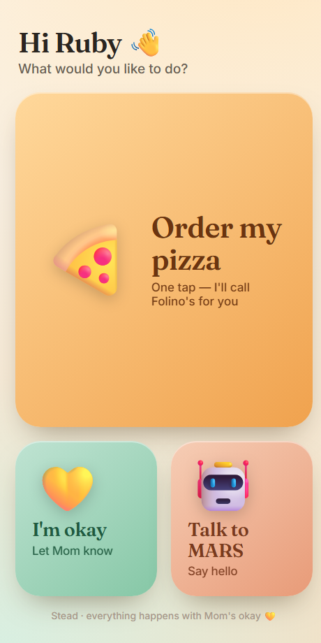
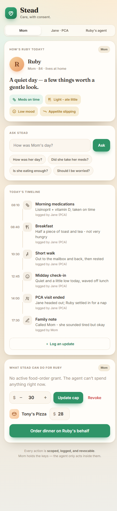

# Stead 🏡

**A consent layer for AI agents acting on behalf of the people who can least supervise them.**

Stead is a phone-first care companion for **Ruby** — 84, lives at home, has cerebral palsy — built so that every actor *and every AI agent* acts **only** inside **scoped, revocable, owner-held, audited** consent. The care app is the wedge; the consent layer is the product.

> Agents are starting to act on people's behalf. They need the same scoped, revocable, audited governance we'd demand of a human aide. Stead is **OAuth/IAM for agents** — demoed in the highest-stakes, most human context there is.

## 🌍 The bigger thesis: sovereign AI for the people AI forgot

General AI literally **cannot hear Ruby.** Off-the-shelf speech models were never trained on dysarthric
(cerebral-palsy) speech, so they mis-hear her — and the millions like her are invisible to the AI
revolution. The fix isn't a bigger general model. It's a **sovereign** one: a model trained on *her* data,
owned by *her family*, running under *their* control — never folded into a hyperscaler's training set.

Sovereign AI for vulnerable people needs three things big tech doesn't hand them. We built on all three:

### ⚡ Nebius — the key to disability empowerment
Sovereign model development requires **on-demand, dedicated GPU you control.** We fine-tuned Ruby's
**personalized voice model** (a Whisper LoRA) on a **Nebius H100** — her own recordings trained a model that
understands *her*, on compute we owned for the hour and then tore down. Her voice never became someone
else's product. The **same** on-demand GPU is what **robotic skill training** needs (MARS learning new
tasks). For vulnerable populations this is the unlock: **train a model on your own data, sovereignly,
without surrendering it.** → [`model/`](model/) — *the loss fell 2.12 → 0.53 on her real audio.*

### 🖐️ Composio — the sovereign action layer
A voice she can use is only half of agency; she also has to *do things*. **Composio** lets her agent act
across real apps — calendar, email, calls — while her guardian holds **scoped, revocable, owner-held**
permission over every action. Power she can exercise, safely, because the people who love her hold the keys.

### 🔌 DGX Spark — ongoing sovereign inference
Train sovereign on Nebius → **serve sovereign on a DGX Spark.** Once her model exists, it runs for ongoing
inference on a local NVIDIA DGX Spark — on-prem / at the edge — so day to day, **her voice and intent never
leave her control.** Cloud to train, edge to live.

> **Train sovereign (Nebius) · act safely (Composio) · serve sovereign (DGX Spark).**
> That's the stack that turns "AI for everyone" into AI for the people it forgot.

**Sister project:** [**Plumbline**](https://github.com/alisoncossette/plumbline) — the open-source
*intent-boundary analyzer* that hardens any agent acting on someone's behalf (it found, and we fixed,
real authority bugs in Stead itself).

<p align="center">
  
  &nbsp;&nbsp;
  
</p>

## Two faces of the same system

- **Ruby's screen** — her *agency*: she can't navigate a dashboard, but she can press a big picture of a pizza, and her agent orders it for her — within Mom's limits.
- **Mom's dashboard** — her *control*: approve/deny requests, set the spending cap, revoke in one tap, and watch the live **consent ledger**.

The bridge between them is consent.

## The agent play

- **Acts within a grant** — Ruby's agent orders dinner ≤ Mom's cap → places a **real outbound phone call** (Vapi) to the restaurant, in a chosen voice.
- **Escalates instead of overstepping** — over the cap, it does **not** fail; it parks a request and **asks Mom**.
- **Owner approves / denies** — live, on her phone; approval mints a scoped grant, denial blocks the action.
- **Attenuating delegation** — when the agent spawns a sub-agent (e.g. the **MARS** robot for a selfie), the sub-grant can only **narrow**, never widen (least privilege).
- **Everything audited** — every grant / act / halt / approve streams to a consent **ledger** (Neon) and to **Langfuse**.

## 🔒 Guardrails & privacy (by design)

- **The voice agent only orders within the amount that's allowed.** It will not place an order a single cent over Mom's live cap. An over-cap request is paused and routed to Mom for approval — the agent never raises its own limit.
- **Ruby's home address is never given out — only *verified*.** On the call, the agent does not read out or hand over her address; it confirms the delivery address the vendor already holds (a yes/no verification), so a personal detail is never broadcast to place an order.
- **Owner-held & revocable** — only the owner (Mom) can grant, change, or revoke. Revocation takes effect on the agent's very next action.
- **Audited end-to-end** — no consequential action happens without a logged consent decision behind it.

## Demo

**▶ Live app:** https://reef-night-across-pets.trycloudflare.com

> ⚠️ That link is a **temporary Cloudflare quick-tunnel** to the local server — it's only up while the
> laptop is running, and free quick-tunnels drop on any network blip (which is exactly what bit us on
> demo day — judges hit a dead tunnel, not a dead app). **The reliable way to see Stead is to run it
> yourself — it's a one-command start (see [Run it](#run-it)).** Everything below is real and verifiable
> locally: the consent engine, the Neon-backed shared brain, the real Vapi pizza call, and the MARS
> skill + agent.

<!-- DEMO VIDEO: drag the .mp4 into GitHub's README editor (it hosts it and gives a player URL),
     or commit it to docs/demo.mp4 and replace the line below with:
     <video src="https://github.com/alisoncossette/buildday/raw/main/docs/demo.mp4" controls width="640"></video> -->

> 📹 _Demo short coming — it'll be embedded here._

### On the robot (MARS)
The pizza order also runs **from the robot**: `robot/skills/order_pizza.py` + `robot/skills/log_mood.py`
deploy to `~/skills/`, and `robot/agents/ruby_agent.py` to `~/innate-os/agents/`. Ruby tells MARS how
she's feeling → it's logged to her care timeline; she says she's hungry → MARS offers Tony's and places
the consent-gated call. Point the robot at the laptop with `STEAD_URL=http://<laptop-ip>:8770`.

## Architecture

| Piece | What it is |
|---|---|
| **Consent engine** (`orchestration-kit/consent_agent/`) | Bolo-shaped `grant / check / revoke / act` + `request → approve/deny` + attenuating `delegate`. Owner-held, audited. In-memory backend keeps tests deterministic; a **Neon Postgres "shared brain"** backend lets the app and agent (separate processes) see the same live consent state. |
| **Care app** (`app/`) | Installable **PWA** (manifest + service worker), stdlib server on `:8770`. Ruby's day + the consent ledger live in **Neon**; **Claude** powers "Ask Stead." Ruby's kiosk is at `/ruby.html`. |
| **Voice / phone** (`agent/tools/phone.py`) | Real outbound calls via **Vapi** (Vapi-native voice, or an ElevenLabs cloned voice). |
| **Robot** (`robot/`, Vocalizer) | **MARS** senses Ruby's day and speaks/acts over rosbridge. |
| **Observability** | Local audit always on; **Langfuse** is the optional external mirror. |

## Verifiable definition of done

`python orchestration-kit/grade.py` exits `0` only when the whole **tier/spiral** passes — each tier independently demoable, every lower tier kept green:

`T1` RBAC · `T2` care companion · `T3` live app · `T4` act-on-behalf (HALT on overstep) · `T5` voice through MARS · `T6` request → approve → attenuating delegation

The tiers were built by an **autonomous build-verify loop** (`orchestration-kit/workflow/build-verify-loop.js`): grade → build the lowest red tier → have independent agents adversarially verify the fix didn't game the tests or regress a banked tier → re-grade.

## Run it

```bash
pip install -r orchestration-kit/requirements.txt
cp .env.example .env          # fill in your keys (see below)
python app/server.py          # http://localhost:8770   ·   Ruby's screen: /ruby.html
python orchestration-kit/grade.py   # the scorecard (exits 0 when done)
```

## Deploy (always-on, no laptop)

Stead runs against **Neon (already cloud)**, so the only thing tying it to a laptop was the local
process. Host the server and it's permanently live — app **and** robot point at one stable URL:

```
render.com → New → Blueprint → connect this repo (reads render.yaml)
          → paste your secrets in the dashboard (never committed)
          → deploy → https://stead-XXXX.onrender.com
```

Then on the Jetson: `export STEAD_URL=https://stead-XXXX.onrender.com` and the robot orders through the
cloud, not the laptop. (Render free tier sleeps when idle; Starter/Railway/Fly keep it warm.) The server
binds `$PORT` automatically. `Procfile` + `requirements.txt` work on any PaaS with the same start command.

## Configuration

All secrets live in `.env` (gitignored — **never commit real keys**). See [`.env.example`](.env.example):

- `ANTHROPIC_API_KEY` — "Ask Stead" + the agent
- `DATABASE_URL` — Neon Postgres (Ruby's day + consent ledger); falls back to local SQLite if unset
- `VAPI_API_KEY`, `VAPI_PHONE_NUMBER_ID`, `VAPI_TARGET_PHONE` — outbound calls
- `STEAD_VOICE_PROVIDER` (`vapi` | `11labs`), `STEAD_VOICE_ID`, `ELEVENLABS_API_KEY` — call voice
- `ROSBRIDGE_URL` — the MARS robot (e.g. `ws://<robot-ip>:9090`)
- `LANGFUSE_PUBLIC_KEY` / `LANGFUSE_SECRET_KEY` — optional tracing

---

_Built in a day. Demo-grade, not production — but every consent decision is real._
